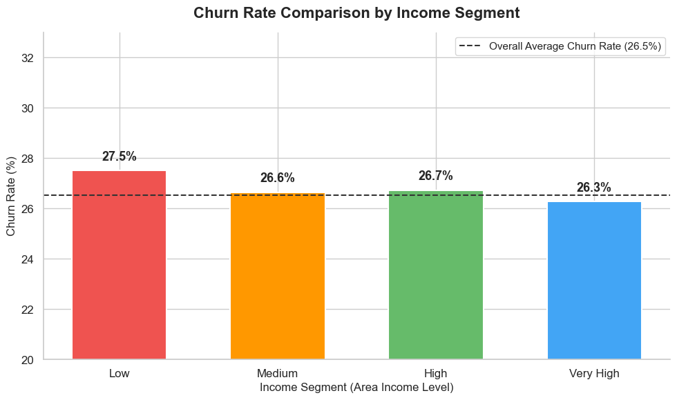
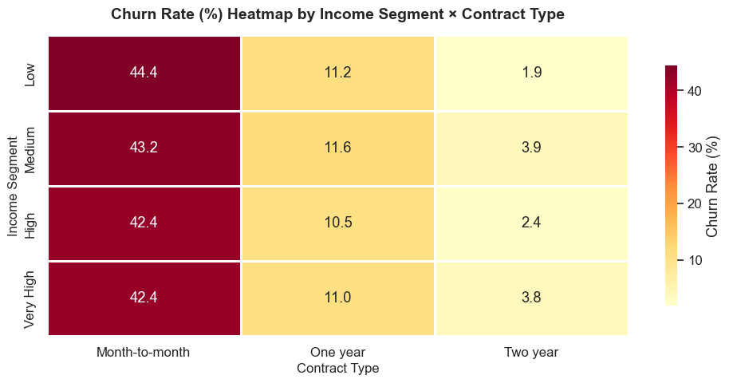
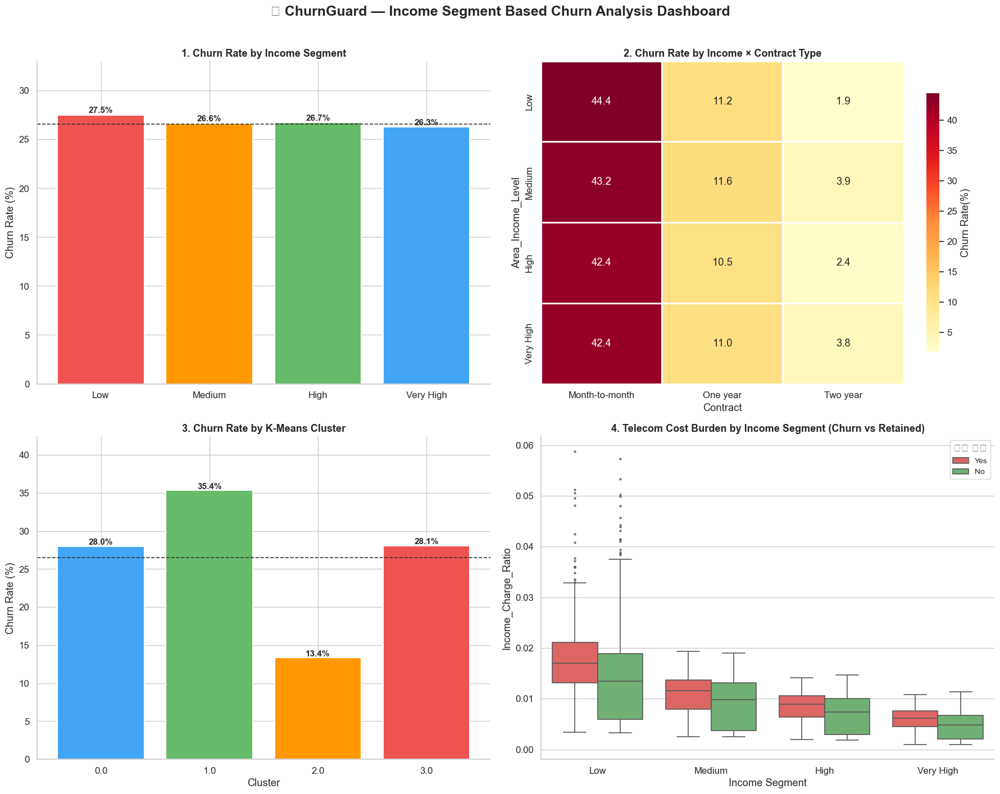
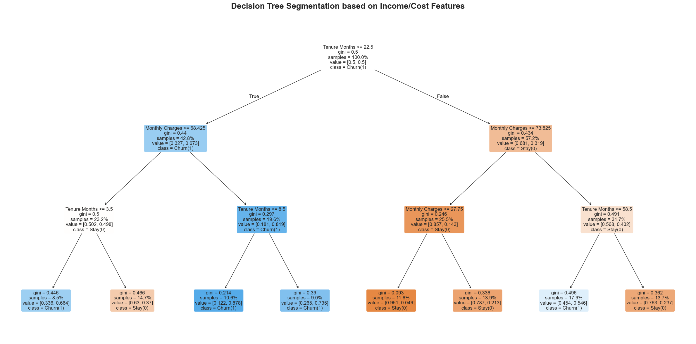

# 🛡️ Churn Guard — 고객 이탈 예측과 리텐션 전략

[English](./README.md) | [한국어](./README.ko.md)

> **우편번호는 보통 버려지는 변수입니다. 이 프로젝트는 우편번호를 공공 소득 데이터와 결합해, "누구에게 어떤 리텐션 혜택을 줄 것인가"를 정하는 기준으로 바꿨습니다.**
> AI@Sogang 2기 새싹반 2조 · 2026-07-10 데모데이 · 현직자 심사

**바로가기:** [결과](#최종-결과) · [팀과 기여](#팀과-기여) · [노트북](#노트북) · [심사 피드백](#데모데이-심사-피드백과-향후-과제) · [프로젝트 보드](docs/PROJECT_BOARD.md) · [로드맵](wiki/Roadmap.md) · [아키텍처](wiki/Architecture.md) · [Notion](https://royal-leaf-0a8.notion.site/2-Churn-Guard-008c77aed06e821db2668139a7a9f6fc)

---

## 우편번호를 버리면 생기는 문제

Churn Guard는 **IBM Telco 고객 이탈 데이터셋 2025 확장판**을 다루는 이진 분류 프로젝트입니다. 데이터는 고객 7,043명 × 33개 컬럼이고, 기본 이탈률은 **26.54%** 입니다. 2020년 Kaggle 버전(21개 컬럼)은 분석 레퍼런스로만 사용했습니다.

이 데이터셋을 다루는 대부분의 자료는 `Zip Code` 컬럼을 버립니다. 고유값이 1,652개나 되어 원-핫 인코딩하면 차원이 폭발하기 때문입니다.

하지만 우편번호는 **고객이 어디에 살고 어느 정도의 지불 여력을 갖는지**를 대변하는 단서입니다. 그래서 이 프로젝트는 우편번호를 인코딩 대상이 아니라 **미국 인구통계국 소득 데이터와 이어붙이는 결합 키**로 사용했습니다.

목표는 리더보드 점수가 아니었습니다. **"왜 이탈하는가"를 설명 가능한 AI(SHAP)로 입증하고, 실제로 실행할 수 있는 리텐션 액션**을 비용과 함께 제시하는 것이었습니다.

## 최종 결과

데모데이(7/10)에 발표한 수치와, 저장소에 커밋된 노트북을 다시 실행했을 때의 수치를 **함께** 적었습니다. 두 값이 다른 경우, 발표 자료를 만드는 과정에서 중간 실행 결과가 쓰였기 때문입니다.

| 항목 | 데모데이 발표 | 노트북 재현값 | 출처 |
|---|---|---|---|
| 베이스라인 최고 Recall (Precision ≥ 0.45 조건에서 threshold 튜닝) | Random Forest **Recall 0.893** (threshold 0.35) | 동일 (0.8930) | `examples/Telco_Customer_Churm2025_003 AI_Sogang_mini.ipynb` |
| 통합 모델 (소득·지역·군집 피처 전체) | ROC-AUC 0.8356 / Recall 0.8934 | ROC-AUC **0.8490** / Recall **0.8761** (threshold 0.20) | `notebooks/ensemble_segmentation_churn_analysis.ipynb` 셀 14 |
| 도시 규모 피처 기반 LightGBM | ROC-AUC 0.8645 / Recall 0.80 | ROC-AUC **0.8526** / Recall 0.79 | `examples/ai_sogang_project_final.ipynb` |
| 소득 결합률 | 99.94% (우편번호 1,652개 중 1,651개) | 동일 | `notebooks/census_income_join.ipynb` |
| 통신비 부담률 T-검정 (이탈 vs 유지) | 1.08% vs 0.87%, p = 4.76e-31, t = 11.72 | 동일 | `notebooks/income_segmentation_churn_analysis.ipynb` |
| 저소득층 이탈률 | 30.00% | **27.51%** | 위와 동일 |
| 저소득 + 무약정 → 저소득 + 2년 약정 이탈률 | 46.75% → 7.89% | **44.41% → 1.85%** | 위와 동일 |

> 발표 표의 통합 모델 수치(0.8356 / 0.8934)는 노트북 셀 19에 직접 입력된 값입니다. 계산된 값은 셀 14의 결과입니다.

**핵심 이탈 위험 요인 (SHAP 상위 3개):** 무약정(Month-to-month) 계약, 부양가족 없음, 짧은 가입 기간. 그다음으로 온라인 보안·기술 지원 미가입, 전자수표 결제, 광케이블 인터넷이 뒤를 이었습니다.

**소득 변수의 실제 역할:** 소득 대비 통신비 부담률(`Income_Charge_Ratio`)은 이탈 고객에서 통계적으로 유의하게 높았습니다. 하지만 이탈과의 상관은 0.15로 월 요금(0.19)보다 약했고, SHAP 상위 15개에도 들지 못했습니다. 즉 소득 변수는 **모델 성능을 끌어올리기보다, 리텐션 혜택을 줄 대상을 고르는 기준**으로 가치가 있었습니다.

## 데이터가 보여준 것

**소득만으로는 이탈이 거의 갈리지 않습니다.** 소득 구간별 이탈률은 27.5% / 26.6% / 26.7% / 26.3%로 사실상 평평합니다.



**소득을 약정 유형과 교차하면 이야기가 달라집니다.** 같은 고객을 약정 형태로 나누자 이탈률이 **44.4%에서 1.9%까지** 벌어졌습니다. 저소득 × 무약정이 위험 구간이고, 약정이 곧 지렛대입니다.



**세그먼트 종합 대시보드**는 소득 구간·약정·군집별 이탈률과 통신비 부담률 분포를 보여줍니다.



**의사결정나무**로 군집 결과를 사람이 읽을 수 있는 규칙과 대조해 검증했습니다.



**부가서비스는 이탈을 붙잡는 장치입니다.** 부가서비스를 1개만 쓰는 고객의 이탈률은 45.76%였고, 6개를 모두 쓰는 고객은 5.28%였습니다 (`examples/AI_SOGANG_PROJECT_DEMODAY(7_10).ipynb`).

## 리텐션 전략과 손익 추정

데모데이에서 제안한 3가지 리텐션 액션입니다.

1. **가격 부담 완화:** 저소득층 중 통신비 부담률 상위 25% 고객에게 3개월 20% 할인 또는 저가 요금제 전환을 제안합니다.
2. **약정 전환 유도:** 저·중소득 무약정 고객에게 1~2년 약정 전환 시 15% 할인과 위약금 면제를 제공합니다.
3. **부가서비스 결합:** 부가서비스 미가입 고위험 고객에게 보안·기기보호 "안심 번들"을 월 $5~10 할인가로 제공합니다.

**액션 1의 손익 추정**

| 항목 | 데모데이 발표 | 노트북 재현 이탈률로 다시 계산 |
|---|---|---|
| 대상 | 저소득 1,621명 × 상위 25% ≈ 405명 | 동일 |
| 마케팅 비용 | 405명 × $64.6 × 20% × 3개월 = $15,697 | 동일 |
| 방치 시 이탈 예상 | 405명 × 30% ≈ 121명 | 405명 × 27.51% ≈ 111명 |
| 방어 매출 (이탈 예정자의 50%를 1년 유지) | 60명 × $64.6 × 12개월 = $46,512 | 55명 × $64.6 × 12개월 = $42,636 |
| **순효과** | **연 약 $30K** | **연 약 $27K** |

방어율 50%는 측정값이 아니라 보수적으로 잡은 **가정**입니다.

고객별 이탈 확률과 액션 매핑 결과는 [`data/retention_action_plan.csv`](data/retention_action_plan.csv)에 있습니다. 소득 데이터가 있는 고객 6,475명이 대상입니다.

| 액션 | 고객 수 |
|---|---|
| 기본 유지 혜택 제공 | 2,014 |
| 장기 약정 전환 유도 + 결합 쿠폰 | 1,957 |
| 장기 약정 전환 유도 | 1,614 |
| 결합 쿠폰 제공 | 890 |

## 팀과 기여

기여 내용은 팀 카카오톡 대화 기록(6/22–7/8), 7/1 회의록, 각자 공유한 산출물을 근거로 정리했습니다. 팀원별 상세 기여와 회의록은 [팀 Notion](https://royal-leaf-0a8.notion.site/2-Churn-Guard-008c77aed06e821db2668139a7a9f6fc)에 있습니다.

| 이름 | 역할 | 주요 기여 |
|---|---|---|
| **박재현** | PM · 데이터 결합 | 미국 인구통계국 ACS 2024(S1901) 소득 데이터 수집과 우편번호(ZCTA) 결합(`data/telco_churn_with_income.csv`)을 맡았습니다. 소득 파생 변수(`Area_Median_Income`, `Income_Charge_Ratio`, `Area_Income_Level`)를 설계하고 소득·가구 기반 세그멘테이션을 수행했습니다. 7/1 Zoom 회의를 열었고, Notion·GitHub 관리를 담당했습니다. |
| **지덕현** | 모델링 | 7/1 중간 회의까지 가입 기간·월 요금 기준 K-Means 군집과 의사결정나무로 초고위험군(무약정·광케이블·기술 지원 미가입)을 도출했습니다(7/1 회의록). 이후 도시 규모 기반 세그멘테이션과 `City_Charge_Ratio` 피처를 만들고 최적화 LightGBM을 구축했습니다(`examples/ai_sogang_project_final.ipynb`). Lasso 피처 선택 실험을 했고, SMOTE와 `scale_pos_weight`를 비교했습니다(SMOTE 적용 시 Recall 0.66으로 하락해 클래스 가중치 방식을 채택). 회의 안건과 역할 분담도 정리했습니다. |
| **조정헌** | 베이스라인 · 해석 | 로지스틱 회귀 베이스라인과 threshold 조정(0.4에서 Recall 0.8717)을 수행했습니다. Decision Tree 규칙 기반 세그멘테이션을 만들고, 피처 세트 4종 × LR/RF/LightGBM을 비교한 뒤 SHAP·Feature Importance로 해석했습니다. 이 보고서 형식이 팀 결과 공유의 표준이 되었습니다(`docs/Telco_Churn_*_조정헌.docx`). |
| 최서빈 | 멘토 | 주제 선정 피드백과 협업 방식 조언을 맡았습니다. |

> 발표 자료와 `ensemble_segmentation_churn_analysis.ipynb`의 비교 표에는 "Jeonghyun (Geo-LGBM)", "Duckhyun (Cluster-LR)"이라는 라벨이 붙어 있습니다. 대화 기록과 산출물을 기준으로 보면 도시 기반 LightGBM은 지덕현, LR(Recall 0.8717)은 조정헌의 결과입니다.

## 노트북

노트북은 팀원별로 병행 작업한 결과를 모은 것입니다. 한 줄로 이어지는 파이프라인이 아니므로 각자 독립적으로 여십시오.

| 노트북 | 내용 | 작업자 |
|---|---|---|
| `examples/AI_SOGANG_PROJECT_DEMODAY(7_10).ipynb` | 초기 EDA, 로지스틱 회귀 베이스라인, 부가서비스 수별 이탈률 | 지덕현 |
| `examples/Telco_Customer_Churm2025_002 (1).ipynb` | 로지스틱 회귀 베이스라인, threshold 튜닝, 지역 변수 실험, Decision Tree 세그멘테이션 | 조정헌 |
| `examples/Telco_Customer_Churm2025_003 AI_Sogang_mini.ipynb` | 피처 세트 4종 × LR/RF/LightGBM 비교, threshold 튜닝, SHAP | 조정헌 |
| `examples/ai_sogang_project_final.ipynb` | 도시 규모 세그멘테이션, `City_Charge_Ratio`, LightGBM 최적화, SHAP 기반 리텐션 | 지덕현 |
| `notebooks/census_income_join.ipynb` | ACS 소득 데이터 ZCTA 결합 → `data/telco_churn_with_income.csv` | 박재현 |
| `notebooks/income_segmentation_churn_analysis.ipynb` | `Income_Charge_Ratio` 설계, T-검정, 소득 세그먼트 × 약정 분석, K-Means | 박재현 |
| `notebooks/ensemble_segmentation_churn_analysis.ipynb` | 소득·지역·군집 피처 통합 모델과 팀원 모델 비교 | 팀 통합 |
| `notebooks/customer_retention_strategy.ipynb` | 고객별 이탈 확률 → 리텐션 액션 매핑. 결과는 `data/retention_action_plan.csv`로 저장되어 있습니다(노트북에 내보내기 셀은 없음) | 팀 통합 |

보고서: [`docs/Telco_Churn_Baseline_Report_조정헌.docx`](docs/Telco_Churn_Baseline_Report_조정헌.docx), [`docs/Telco_Churn_Project_Report_조정헌.docx`](docs/Telco_Churn_Project_Report_조정헌.docx)

## 실행 방법

```bash
git clone https://github.com/PJH720/churn-guard.git
cd churn-guard
uv sync
uv pip install scikit-learn shap imbalanced-learn openpyxl
```

원본 데이터(`data/2025/`, `data/ACSST5Y2024.S1901_*/`)와 결합 산출물(`data/telco_churn_with_income.csv`)이 저장소에 함께 들어 있습니다.

일부 노트북(`examples/` 아래)은 Google Colab에서 작성되어 파일 경로가 Colab 기준입니다. 로컬에서 실행하려면 경로를 `data/` 아래 파일로 바꿔야 합니다.

## 데이터 규약

- **타깃:** `Churn Value`(1 = 이탈)입니다. `Churn Label`, `Churn Score`, `Churn Reason`은 이탈 이후에만 알 수 있는 값이라 **누수 변수로 제외**합니다.
- **`Total Charges` 결측 11건:** 모두 가입 기간 0개월인 신규 고객입니다. 행을 삭제하지 말고 0으로 채웁니다.
- **지리 변수:** `City`, `Zip Code`, `Latitude`, `Longitude`는 모델에 직접 넣지 않고, EDA와 외부 데이터 결합 키로만 사용합니다.
- **평가 기준:** 재현율(Recall)을 우선하되 Precision ≥ 0.45 조건을 두고, F1과 ROC-AUC를 함께 봅니다. 기본 이탈률이 26.5%이므로 정확도(Accuracy)로 순위를 매기지 않습니다.

## 데모데이 심사 피드백과 향후 과제

현직자 심사위원 두 분에게 받은 피드백을 정리했습니다.

- **피처 엔지니어링이 가장 큰 강점입니다.** 우편번호 → 소득처럼 외부 데이터를 결합하는 방향을 더 확장할 것을 권했습니다.
- **SMOTE는 지양합니다.** 범주형 인코딩 변수에 비현실적인 값을 만들어냅니다. `scale_pos_weight` 같은 클래스 가중치로 충분합니다.
- **Lasso는 이 문제에 맞지 않습니다.** 선형회귀 기반이라 이진 분류 타깃과 맞지 않는다는 지적이었습니다.
- **클래스 불균형을 무조건 해소하지 않습니다.** 실무에서는 현실 분포를 유지하는 경우가 많습니다.
- **Recall 하나만 최적화하지 않습니다.** AUC·F1 등 종합 지표로 평가해야 합니다. threshold 조정은 리스크 헤징 목적이 명확할 때만 의미가 있습니다.
- **피처와 타깃의 1:1 상관보다 피처 간 조합·상호작용과 인과관계를 봐야 합니다.**
- **비슷한 조건인데 이탈 여부가 갈리는 엣지 케이스부터 역으로 분석**하는 접근을 권했습니다.

## 한계

- **$27K~30K는 방어율 50%라는 가정 위의 추정치입니다.** 타깃 405명을 대상으로 A/B 테스트를 하면 실제 방어율로 대체할 수 있습니다.
- **소득 결합은 우편번호(ZCTA) 단위입니다.** 같은 우편번호의 고객은 모두 같은 중위소득을 물려받습니다.
- **소득 데이터가 없는 고객 568명(8.1%)은 소득 기반 분석에서 제외했습니다.** 그래서 세그먼트·액션 분석은 6,475명 기준입니다.
- **인과가 아니라 상관입니다.** T-검정은 이탈 고객의 통신비 부담이 더 무겁다는 사실을 보여줄 뿐, 요금을 낮추면 이탈이 줄어든다는 것을 증명하지는 않습니다.
- **노트북 간 테스트 분할이 통일되지 않았습니다.** 팀원별 수치는 서로 다른 전처리와 분할에서 나온 것이라 엄밀한 비교가 아닙니다.

## 프로젝트 진행

| 일자 | 내용 |
|---|---|
| 6/22 | 팀 구성, 멘토 배정 |
| 6/26 | 주제 제안 4건과 멘토 피드백, 투표 |
| 6/27 | 주제 확정: 고객 이탈 예측과 리텐션 전략 |
| 6/28 | 킥오프 — 역할 분담, IBM 2025 확장 데이터셋으로 전환 |
| 6/29 | 데이터 전처리·EDA 진행 공유 |
| 7/1 | 중간 회의 — 팀원별 세그멘테이션(소득·도시 규모·의사결정나무) 공유, 각자 LightGBM까지 돌려 Recall로 비교하기로 합의 |
| 7/2 | 소득 데이터를 반영한 피처 세트 4종 × 3개 모델 비교, SHAP 해석 |
| 7/8 | 최종 취합 — 팀원별 코드 비교, Lasso·SMOTE 실험 공유, 발표 자료 제작 |
| **7/10** | **데모데이** — 발표 7분 + 질의응답 5분, 현직자 심사 |

자세한 회의록은 [팀 Notion](https://royal-leaf-0a8.notion.site/2-Churn-Guard-008c77aed06e821db2668139a7a9f6fc)에, 작업 계획은 [프로젝트 보드](docs/PROJECT_BOARD.md)에 있습니다.

## 저장소 구조

| 경로 | 역할 |
|---|---|
| `notebooks/` | 소득 결합, 세그멘테이션, 통합 모델, 리텐션 액션 |
| `examples/` | 팀원별 모델링 노트북, 참고 노트북 |
| `data/2025/` | IBM Telco 2025 원본 데이터 (xlsx) |
| `data/ACSST5Y2024.S1901_*/` | 미국 인구통계국 ACS 2024 가구소득 원본 |
| `data/telco_churn_with_income.csv` | 소득 결합 산출물 |
| `data/retention_action_plan.csv` | 고객별 리텐션 액션 결과 |
| `docs/figures/` | README와 발표에 사용한 그래프 |
| `docs/` | 프로젝트 보드, 마일스톤, 팀원 보고서 |
| `wiki/` | 로드맵, 아키텍처 |
