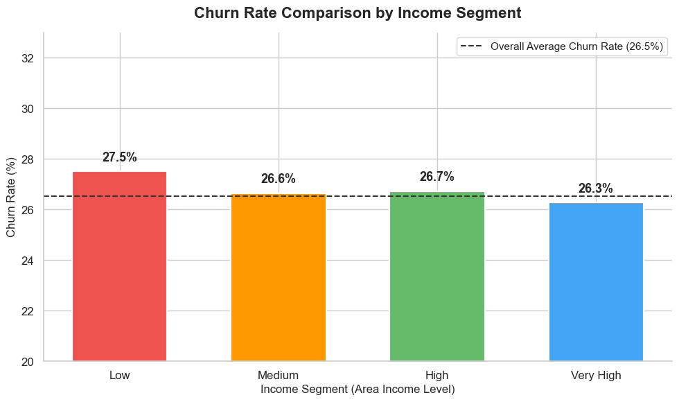
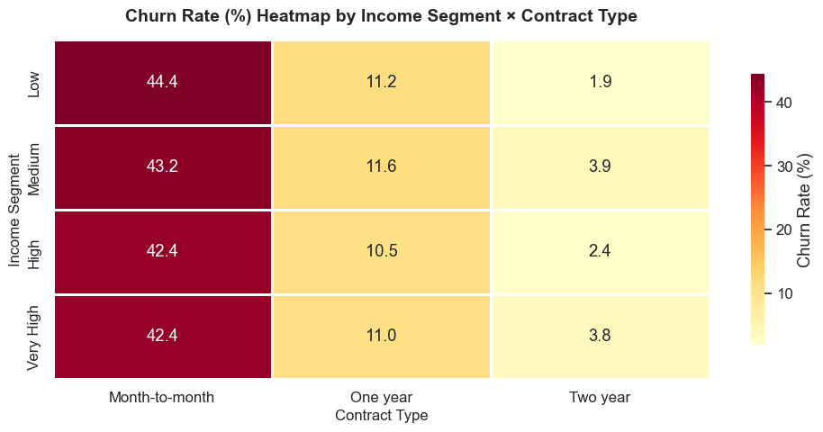
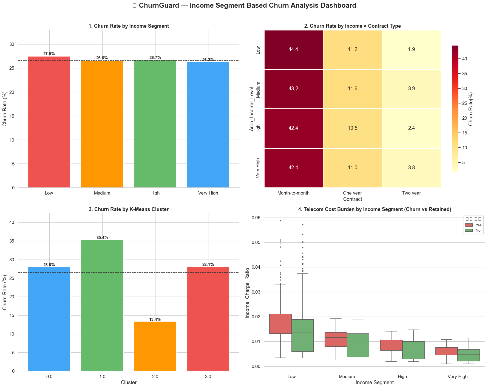
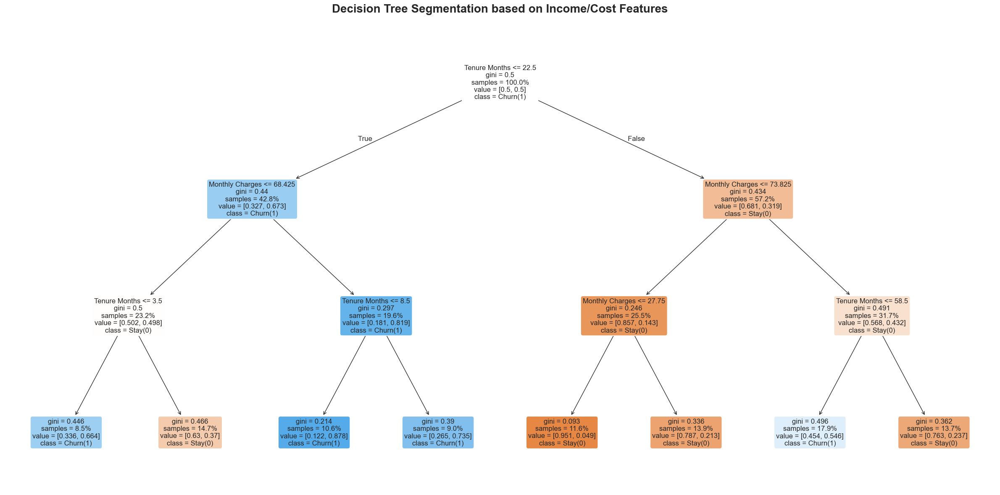
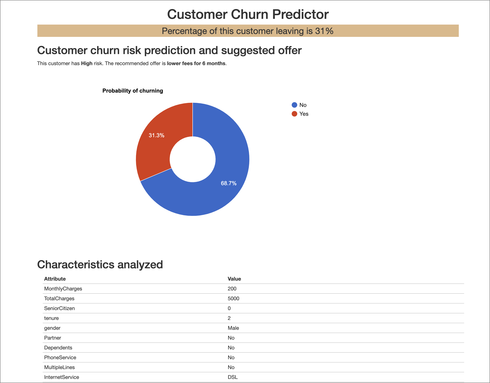

# 🛡️ Churn Guard — Customer Churn Prediction & Retention Strategy

[English](./README.md) | [한국어](./README.ko.md)

> **The Zip Code column is usually thrown away. We joined it to public income data and turned it into ≈ $30K of defended profit per year.**
> AI@Sogang Sprout Cohort 2 · Demo Day 2026-07-10 · judged by industry practitioners

**Links:** [Notebooks](#notebooks) · [Project Board](docs/PROJECT_BOARD.md) · [Roadmap](wiki/Roadmap.md) · [Architecture](wiki/Architecture.md) · [Milestones](https://github.com/PJH720/churn-guard/milestones)

---

## The problem with dropping Zip Code

Churn Guard is a binary-classification project on the **IBM Telco Customer Churn** dataset (7,043 customers × 21 columns, base churn rate **26.54%**). Every tutorial on this dataset drops `Zip Code`: 1,652 unique values, one-hot encode it and your feature space explodes.

But a zip code is not noise. It is a proxy for **where the customer lives and what they can afford**. So instead of encoding it, we used it as a **join key** to public income data — and the resulting feature turned out to explain churn better than the raw bill amount does.

The deliverable was never a leaderboard score. It was **three risk factors and three retention actions a manager can approve on Monday**, with the cost and the defended revenue attached.

## Final results

| Step | What was done | Result |
|---|---|---|
| **1. Enrich** | Joined US Census Bureau ACS 2024 (S1901) median household income onto the Telco data by ZCTA | **99.94%** join rate (1,651 / 1,652 zip codes; the 1 miss imputed with the median) |
| **2. Engineer** | Built `Income_Charge_Ratio` = monthly charge ÷ area median household income — the customer's *felt* cost burden | A continuous feature, so no dimensionality blow-up |
| **3. Test** | Independent two-sample t-test, churned vs retained | Churned **1.08%** vs retained **0.87%** · **p = 4.76e-31**, t = **11.72** |
| **4. Segment** | K-Means clustering + SHAP attribution over income segment × contract type | **Low-income + month-to-month churns at 46.75%** — ~2× the 26.5% base rate |
| **5. Act** | Costed a retention promotion against the revenue it defends | **≈ $30K net profit defended per year** |

Final model: **LightGBM, ROC-AUC 0.8356**, tuned toward recall — a missed churner costs more than a wasted discount.

## What the data showed

**Income alone explains almost nothing.** Churn barely moves across income segments — 27.5% / 26.6% / 26.7% / 26.3%. If you stop here, zip code looks useless.



**Income crossed with contract type explains a great deal.** The same customers, split by how they are locked in, span **44.4% down to 1.9%**. Low income plus month-to-month is the danger zone; the contract is the lever.



**The full segment picture** — churn by income band, by contract, by K-Means cluster, and the cost-burden distribution of churned vs retained customers.



**Where the split actually happens** — a decision tree over the income and cost features, used to sanity-check the clusters against something a human can read.



## The retention action, costed out

- **Target:** low-income customers in the top 25% of cost burden — **405 customers**
- **Offer:** 20% discount for 3 months → marketing cost **405 × $64.6 × 20% × 3 = $15,697**
- **Conservative assumption:** of the 121 expected churners, only **50% (60 customers)** stay for a year → **60 × $64.6 × 12 = $46,512** defended
- **Net:** $46,512 − $15,697 ≈ **$30K per year**
- **Bonus:** moving those customers onto a 2-year contract drops churn from **46.75% → 7.89%** (**−38.86%p**)

The individual-customer view, showing a risk score and the matching offer:



## Notebooks

Run in order — each consumes the previous one's output.

| # | Notebook | Role |
|---|---|---|
| 1 | `examples/customer-churn-1-eda.ipynb` | EDA, cleaning, feature engineering |
| 2 | `notebooks/census_income_join.ipynb` | ACS income join by ZCTA → `data/telco_churn_with_income.csv` |
| 3 | `notebooks/income_segmentation_churn_analysis.ipynb` | `Income_Charge_Ratio` design + t-test |
| 4 | `notebooks/ensemble_segmentation_churn_analysis.ipynb` | K-Means segmentation, churn by segment × contract |
| 5 | `notebooks/customer_retention_strategy.ipynb`<br>`notebooks/(logic only) shap_retention_strategy.ipynb` | SHAP interpretation → retention actions → `data/retention_action_plan.csv` |
| — | `examples/ai_sogang_project_final.ipynb` | Demo Day notebook (end-to-end) |

## Quickstart

```bash
git clone https://github.com/PJH720/churn-guard.git
cd churn-guard
uv sync                      # or: pip install pandas numpy matplotlib seaborn lightgbm ipykernel
jupyter notebook notebooks/census_income_join.ipynb
```

Raw data ships with the repo (`data/2025/`, `data/ACSST5Y2024.S1901_*/`), so the notebooks run without any external download.

## Data conventions (load-bearing)

Downstream notebooks depend on these, set in the EDA notebook:

- **Working copy:** all cleaning happens on `df_clean = df.copy()`, never the raw `df`.
- **Target:** `Churn_Flag = df_clean["Churn"].map({"Yes":1,"No":0})` — use `Churn_Flag` for math, keep `Churn` for labels.
- **`TotalCharges` is dirty:** loads as `object` (11 blanks, all `tenure == 0` new customers) → `pd.to_numeric(..., errors="coerce").fillna(0)`. **Do not drop these rows.**
- **Derived columns:** `Tenure_Group` (`pd.cut` bins `[-1,12,24,48,72]`), `Risk_Factor_Count` (0–5 composite), `Income_Charge_Ratio`.
- **Helper:** `churn_summary(column)` → per-category `Customer_Count` + `Churn_Rate_%`, sorted descending. Reuse it.
- **Evaluation:** optimize **recall first**, then F1 and ROC-AUC. **Never rank by accuracy** — at a 26.5% base rate it is misleading.

## Repository layout

| Path | Role |
|---|---|
| `notebooks/` | The analysis pipeline (income join → segmentation → retention strategy) |
| `examples/` | EDA notebook, Demo Day notebook, and reference notebooks |
| `data/2025/` | IBM Telco source data (xlsx) |
| `data/ACSST5Y2024.S1901_*/` | US Census Bureau ACS 2024 household-income source data |
| `data/telco_churn_with_income.csv` | Join output — the handoff artifact downstream notebooks read |
| `data/retention_action_plan.csv` | Final per-customer retention targeting output |
| `docs/figures/` | Analysis figures used in this README and the Demo Day deck |
| `docs/PROJECT_BOARD.md`, `docs/milestones/` | Milestone and issue tracking |
| `wiki/Roadmap.md`, `wiki/Architecture.md` | Timeline and technical architecture |

## Limitations & next steps

- **The $30K rests on an assumed 50% retention rate.** It is a deliberately conservative planning number, not a measurement. Running an A/B test on the 405 targeted customers would replace the assumption with a real rate.
- **The income join is at ZCTA granularity**, so every customer in a zip code inherits the same median income. That understates within-zip variation; household-level income would sharpen the burden ratio.
- **Correlation, not causation.** The t-test shows churned customers carry a heavier cost burden; it does not prove that lowering the bill causes them to stay. Only the experiment above can.

## Project context

| Date | Event |
|---|---|
| 6/23 – 7/8 | Project work period |
| 6/26 | Midterm — problem definition, EDA insights, LR baseline |
| **7/10** | **Demo Day** — final presentation, judged by industry practitioners |

Work was organized into three milestones mirroring the class phases — see the [Project Board](docs/PROJECT_BOARD.md) and [Roadmap](wiki/Roadmap.md).
