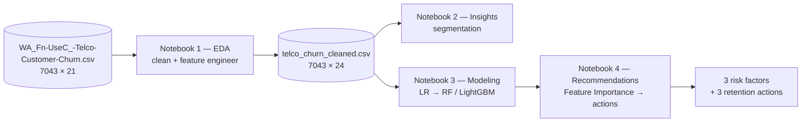

# Architecture

Technical architecture for **Churn Guard**. The system is a **4-notebook pipeline** where each stage consumes the previous stage's cleaned output. Only notebook 1 is built today.

## Data flow

## The handoff contract
`telco_churn_cleaned.csv` (7043×24) is the single source of truth for notebooks 2–4. **Read it, not the raw CSV.** It is produced by notebook 1's final cell and is the boundary between "data prep" and "modeling".

> ⚠️ Notebook 1 hardcodes a Kaggle `file_path`. Locally, point it at the repo-root raw CSV.

## Dataset schema (raw)
7,043 customers × 21 columns. Target `Churn` (Yes/No), base rate 26.54%.
- **Demographic:** `gender`, `SeniorCitizen`, `Partner`, `Dependents`
- **Account:** `tenure`, `Contract`, `PaperlessBilling`, `PaymentMethod`, `MonthlyCharges`, `TotalCharges`
- **Services:** `PhoneService`, `MultipleLines`, `InternetService`, `OnlineSecurity`, `OnlineBackup`, `DeviceProtection`, `TechSupport`, `StreamingTV`, `StreamingMovies`
- **Key / target:** `customerID`, `Churn`

## Load-bearing conventions
| Convention | Rule |
|---|---|
| Working copy | `df_clean = df.copy()` — never mutate raw `df` |
| Target | `Churn_Flag = df_clean["Churn"].map({"Yes":1,"No":0})` |
| `TotalCharges` | `object` w/ 11 blanks (all `tenure==0`) → `pd.to_numeric(errors="coerce").fillna(0)`; **don't drop** |
| `Tenure_Group` | `pd.cut` bins `[-1,12,24,48,72]` |
| `Risk_Factor_Count` | 0–5 composite risk score |
| `churn_summary(col)` | per-category `Customer_Count` + `Churn_Rate_%`, sorted desc |

## Modeling architecture
- **Baseline:** Logistic Regression — read coefficients for interpretation.
- **Performance:** Random Forest / LightGBM — ensemble accuracy + feature importance.
- **Evaluation:** Recall-first → F1 → ROC-AUC; Confusion Matrix mandatory; minimize Type-II error (missed churners). Accuracy is **not** a selection metric (26.5% imbalance).
- **Interpretation:** Feature Importance / SHAP → Top-3 risk factors → retention actions (AARRR / Retention lens).

## Tech stack
Python · Jupyter · pandas · numpy · matplotlib (no seaborn). No build/lint/test tooling — work is notebook-driven. `requirements.txt` pending ([#2](https://github.com/PJH720/churn-guard/issues/2)).

## Repo layout
See [README](../README.md#repository-layout) and [CLAUDE.md](../CLAUDE.md) for the authoritative file map and conventions.
