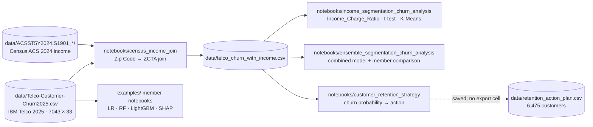

# Architecture

Technical architecture for **Churn Guard** as delivered at Demo Day (7/10).

The original plan was a 4-notebook pipeline built on the 2020 Kaggle dataset. In practice, the team switched to the IBM Telco **2025** extension and each member worked in a separate notebook. The only shared lineage is the income-join chain below. Member notebooks in `examples/` are independent and do not feed each other.

## Data flow

```mermaid
flowchart LR
    telco[("data/Telco-Customer-Churn2025.csv<br/>IBM Telco 2025 · 7043 × 33")] --> join
    acs[("data/ACSST5Y2024.S1901_*/<br/>Census ACS 2024 income")] --> join
    join["notebooks/census_income_join<br/>Zip Code → ZCTA join"] --> inc[("data/telco_churn_with_income.csv")]
    inc --> seg["notebooks/income_segmentation_churn_analysis<br/>Income_Charge_Ratio · t-test · K-Means"]
    inc --> ens["notebooks/ensemble_segmentation_churn_analysis<br/>combined model + member comparison"]
    inc --> ret["notebooks/customer_retention_strategy<br/>churn probability → action"]
    ret -. "saved; no export cell" .-> plan[("data/retention_action_plan.csv<br/>6,475 customers")]
    telco --> ex["examples/ member notebooks<br/>LR · RF · LightGBM · SHAP"]
```

## Data sources
| Source | Path | Notes |
|---|---|---|
| IBM Telco Customer Churn 2025 | `data/Telco-Customer-Churn2025.csv` (IBM xlsx files are in `data/2025/`) | 7,043 customers × 33 columns, churn rate 26.54% |
| US Census ACS 2024 5-year, S1901 | `data/ACSST5Y2024.S1901_*/` | Household income by ZCTA |
| Income-joined table | `data/telco_churn_with_income.csv` | 1,651 of 1,652 zip codes matched (99.94%); 568 customers (8.1%) have no income value |
| Kaggle Telco 2020 (reference only) | `data/WA_Fn-UseC_-Telco-Customer-Churn2020.csv` | 7,043 × 21; used only in early reference notebooks |

## Load-bearing conventions (2025 dataset)
| Convention | Rule |
|---|---|
| Target | `Churn Value` (1 = churned) |
| Leakage | Drop `Churn Label`, `Churn Score`, `Churn Reason` — they are only known after churn |
| `Total Charges` | 11 blanks, all at tenure 0 → fill with 0; **don't drop** |
| Geography | `City`, `Zip Code`, `Latitude`, `Longitude` are join keys and EDA inputs, not model features |
| Income features | `Area_Median_Income`, `Income_Charge_Ratio`, `Area_Income_Level` (from the ACS join) |
| City feature | `City_Charge_Ratio` (city-size segmentation) |

## Modeling
- **Models:** Logistic Regression baseline, Random Forest, LightGBM.
- **Imbalance:** class weighting (`class_weight`, `scale_pos_weight`). SMOTE was tried and dropped because recall fell to 0.66.
- **Evaluation:** recall first with a precision ≥ 0.45 floor, plus F1 and ROC-AUC. Thresholds were tuned. Accuracy is not a selection metric (26.5% base rate). See [ADR 0001](../docs/adr/0001-recall-first-evaluation.md).
- **Interpretation:** SHAP and feature importance → top 3 risk factors (month-to-month contract, no dependents, short tenure) → 3 retention actions.
- **Known gap:** member notebooks use different preprocessing and test splits, so their numbers are not a strict comparison.

## Tech stack
Python 3.12 · Jupyter · pandas · numpy · matplotlib · seaborn · scikit-learn · LightGBM · SHAP, managed with `uv`. `pyproject.toml` lists only part of this, so the [Quickstart](../README.md#quickstart) installs the rest. There is no build, lint, or test tooling; the work is notebook-driven.

## Repo layout
See the [README](../README.md#repository-layout) for the file map.
